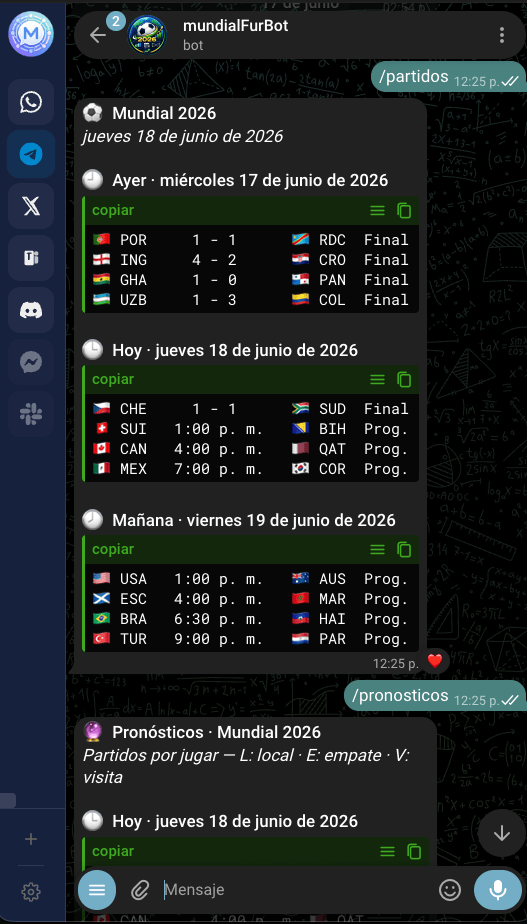

# BotMundial

Bot privado de Telegram que muestra los partidos del **Mundial 2026** consumiendo la API pública de ESPN.

## Demo

▶️ **Video de demostración:** [Ver en YouTube](https://www.youtube.com/shorts/zirr8DJcF0o)

Ejemplo de salida de los comandos `/partidos` y `/pronosticos`:

<p align="center">
  
</p>

## Comandos

| Comando | Quién | Descripción |
|---|---|---|
| `/start` | Todos | Mensaje de bienvenida |
| `/menu` | Todos | Menú principal de comandos |
| `/partidos` | Autorizados | Partidos de ayer, hoy y mañana del Mundial 2026 |
| `/pronosticos` | Autorizados | Pronóstico % de los partidos **por jugar** hoy y mañana |
| `/grupos` | Autorizados | Tabla de posiciones de los grupos del Mundial 2026 |
| `/crearpass <contraseña>` | Owner | Crea una contraseña de un solo uso (sin espacios, mín. 4 caracteres). El usuario que la escriba primero queda autorizado automáticamente. |

## Stack

- Python 3.11+
- python-telegram-bot v21+
- httpx + aiosqlite

## Instalación

```bash
python3 -m venv venv
source venv/bin/activate
pip install -r requirements.txt
cp .env.example .env
# Edita .env y coloca TELEGRAM_BOT_TOKEN y OWNER_CHAT_ID
```

## Ejecución

```bash
python -m app.main
```

## Pronósticos

El comando `/pronosticos` muestra **únicamente los partidos por jugar** (no
jugados ni en vivo) de **hoy y mañana**, cada uno con su pronóstico:

```
🇪🇸 ESP  12:00 p. m.  🇫🇷 FRA
   L 44%  E 27%  V 29%
```

`L` = victoria local, `E` = empate, `V` = victoria visitante (suman 100%).

Se calcula **localmente con un modelo Elo propio** (`app/forecast.py`), sin
APIs externas ni IA. Cada selección tiene un rating Elo y la diferencia (más la
ventaja de localía) determina las probabilidades vía la fórmula logística
clásica de Elo, repartiendo parte al empate. Para recalibrar, edita el mapa
`_ELO` o las constantes (`HOME_ADVANTAGE`, `MAX_DRAW_PROB`, `DRAW_SHARPNESS`) en
`app/forecast.py`.

## Estructura

```
app/
  main.py           # Entry point
  config.py         # Variables .env
  database.py       # SQLite (authorized_users)
  espn.py           # Cliente ESPN + filtro Mundial 2026
  forecast.py       # Pronóstico % por modelo Elo propio (sin APIs externas)
  middleware.py     # auth_check + rate_limit
  formatters.py     # Formato de líneas y secciones
  handlers/         # /start, /partidos, /pronosticos, /grupos, /crearpass, mensajes
sql/
  init.sql          # Schema
data/               # bot.db (gitignored)
```
